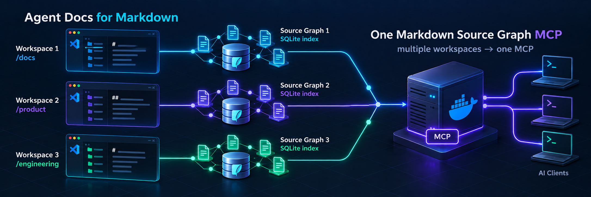
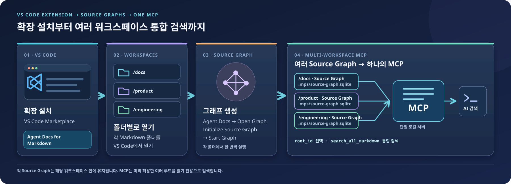
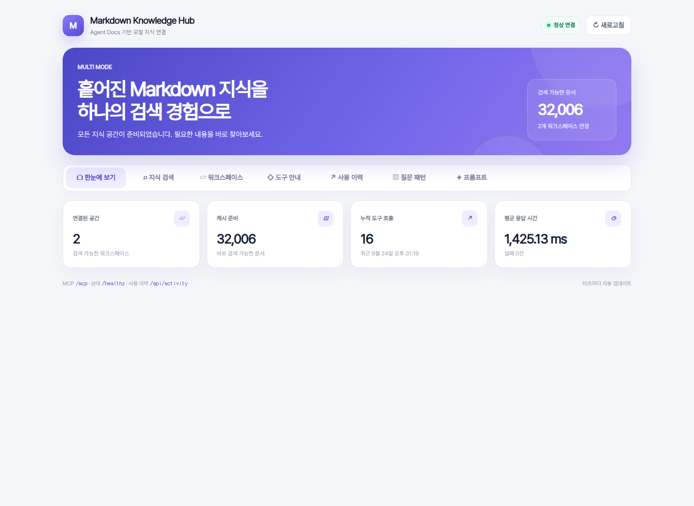
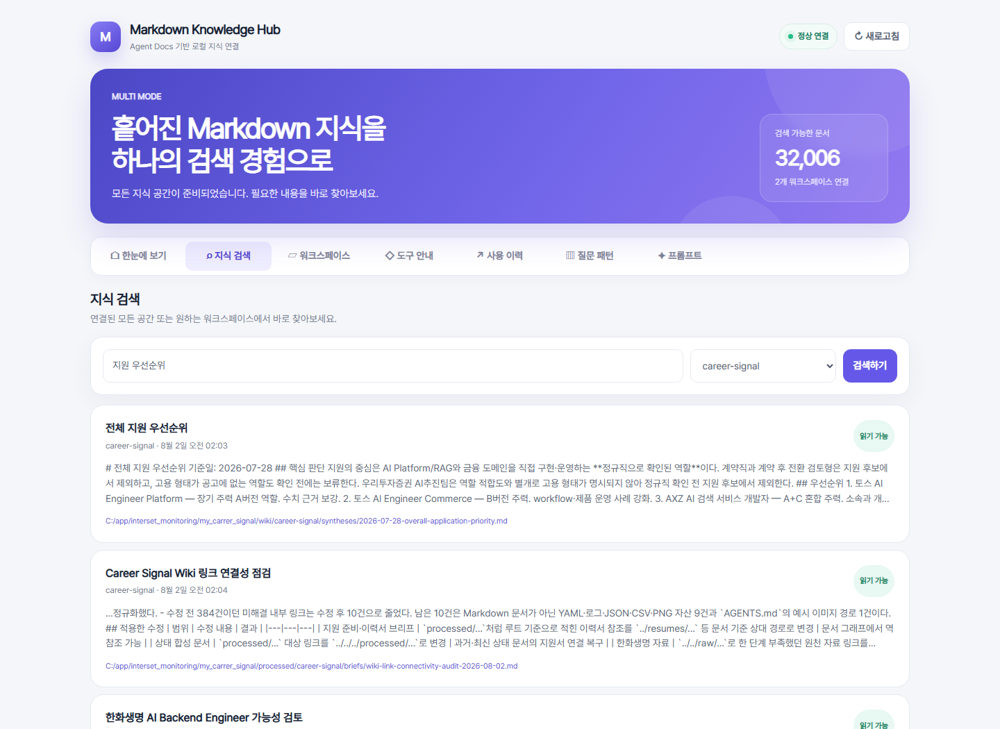
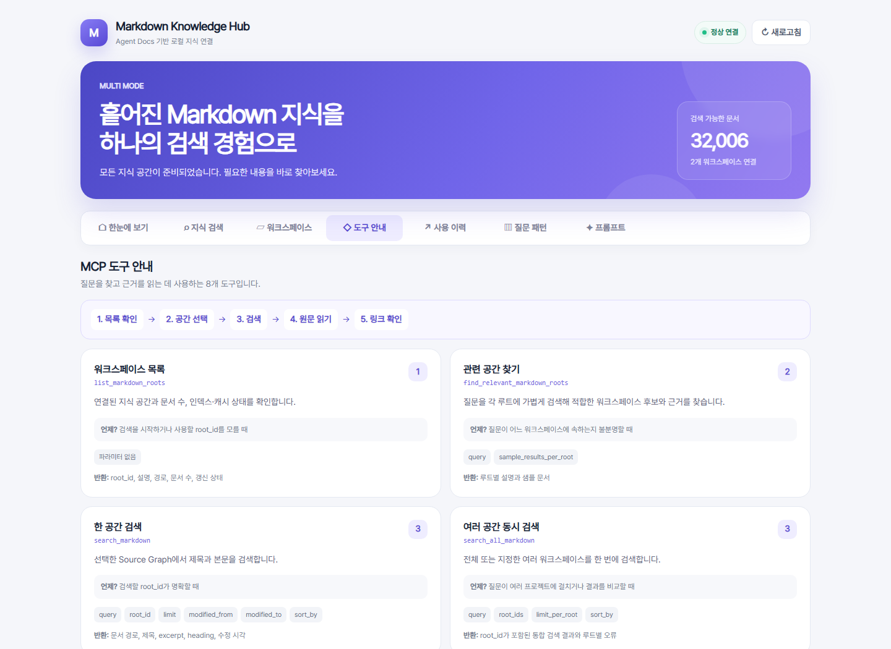
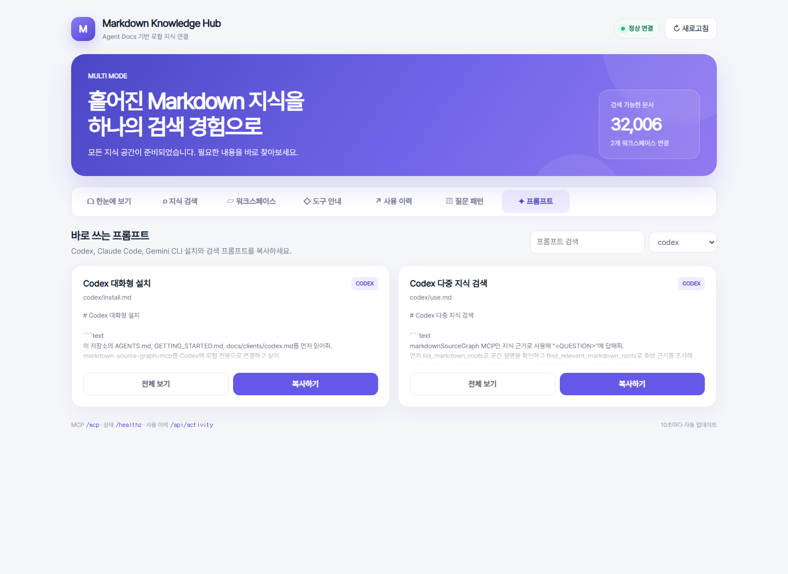
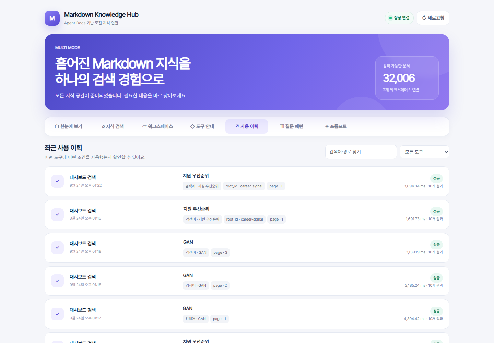

# Markdown Source Graph MCP



[Agent Docs for Markdown](https://marketplace.visualstudio.com/items?itemName=datanewbie-labs.markdown-agent-docs)이
만든 로컬 Source Graph를 Codex, Claude Code, Gemini CLI에서 검색 도구로 사용할 수 있게 해주는
Docker 기반 MCP 서버입니다.

Markdown 원문과 `.mps/source-graph.sqlite`는 읽기 전용으로 마운트됩니다. 서버는 문서를 수정하지
않고, 검색용 캐시만 별도의 Docker 볼륨에 저장합니다.

## 먼저 읽을 문서

- 처음 설치부터 Codex 등록까지: [GETTING_STARTED.md](GETTING_STARTED.md)
- Single, Hub, 오류 및 실제 E2E 검증: [SCENARIOS.md](SCENARIOS.md)
- 저장소에서 작업하는 에이전트 지침: [AGENTS.md](AGENTS.md)

## 제공하는 기능

| MCP 도구 | 용도 |
|---|---|
| `search_markdown` | 제목과 본문을 검색하고 경로, excerpt, heading을 반환 |
| `search_all_markdown` | 여러 워크스페이스를 동시에 검색 |
| `find_relevant_markdown_roots` | 질문을 각 루트에 대입해 적합한 워크스페이스 후보와 근거 반환 |
| `read_markdown` | 검색 결과의 Markdown을 지정한 줄 범위만 읽기 |
| `get_markdown_links` | 문서의 링크와 backlink를 Source Graph에서 조회 |
| `list_markdown_roots` | 연결된 워크스페이스와 인덱스 상태 확인 |
| `get_source_graph_status` | Source Graph 종류, 문서 수, 캐시 최신성 확인 |
| `refresh_markdown_root` | 현재 `.mps` 인덱스를 MCP 검색 캐시로 다시 가져오기 |

검색할 때 Source Graph 파일이 바뀐 것이 감지되면 검색 캐시는 자동으로 갱신됩니다.

## 전체 흐름



각 워크스페이스의 `Agent Docs for Markdown`이 자체 `.mps/source-graph.sqlite`를 만듭니다.
여러 그래프를 하나의 MCP에서 사용하려면 아래의 **Hub** 또는 **Named Multi-root** 모드로
허용할 워크스페이스를 설정합니다. 클라이언트는 `root_id`로 하나를 고르거나
`search_all_markdown`으로 여러 루트를 함께 검색할 수 있습니다.

## 준비 사항

- Docker Desktop 또는 Docker Engine + Compose
- VS Code
- [Agent Docs for Markdown 확장](https://marketplace.visualstudio.com/items?itemName=datanewbie-labs.markdown-agent-docs)
- 검색할 Markdown 워크스페이스

## 1. Agent Docs 확장 설치와 Source Graph 생성

VS Code에서 Marketplace를 열고 `Agent Docs for Markdown`을 설치하거나 다음 명령을 실행합니다.

```powershell
code --install-extension datanewbie-labs.markdown-agent-docs
```

그다음 검색할 Markdown 폴더를 VS Code의 워크스페이스로 엽니다.

1. Activity Bar에서 **Agent Docs**를 엽니다.
2. **Open Graph** 또는 명령 팔레트의 `Agent Docs: Open Source Graph`를 실행합니다.
3. 처음이라면 `Agent Docs: Initialize Source Graph`를 실행합니다.
4. **Start Graph**로 첫 인덱스를 생성합니다.
5. 워크스페이스에 아래 파일이 생겼는지 확인합니다.

```text
<markdown-workspace>/.mps/source-graph.sqlite
```

불필요한 폴더는 `.mps/.mpsignore`에서 제외할 수 있습니다. 확장은 Markdown 저장 시 Source Graph를
자동 갱신할 수 있으며, 이 MCP는 갱신된 SQLite의 변경 시각을 감지해 다음 검색 전에 캐시를 다시
가져옵니다.

## 2. 저장소 클론

```powershell
git clone https://github.com/sungreong/markdown-source-graph-mcp.git
cd markdown-source-graph-mcp
```

## 3. 워크스페이스 경로 설정

`.env.example`을 `.env`로 복사합니다.

```powershell
Copy-Item .env.example .env
```

`.env`의 경로를 실제 Markdown 워크스페이스로 바꿉니다. Windows에서는 역슬래시보다 `/`를
권장합니다.

```dotenv
MARKDOWN_MCP_MODE=single
MARKDOWN_MOUNT_SOURCE=C:/Users/you/Documents/my-markdown-workspace
MARKDOWN_PUBLIC_PATH=C:/Users/you/Documents/my-markdown-workspace
MCP_PORT=8811
```

- `MARKDOWN_MCP_MODE`: 워크스페이스 하나는 `single`, 상위 폴더 하나에서 동적으로 고르면 `hub`
- `MARKDOWN_MOUNT_SOURCE`: Docker에 읽기 전용으로 마운트할 실제 폴더
- `MARKDOWN_PUBLIC_PATH`: MCP 응답에 표시할 호스트 경로
- `MCP_PORT`: 로컬 MCP 포트

Single 모드에서는 워크스페이스 자체를 지정해야 하며 `.mps` 폴더를 직접 지정하면 안 됩니다.

Compose를 실행하기 전에 경로와 인덱스를 검사할 수 있습니다.

```powershell
python scripts/check_workspace.py "C:/Users/you/Documents/my-markdown-workspace"
```

문제가 있으면 오류 메시지와 함께 종료 코드 `2`를 반환합니다.

## 4. Docker Compose 실행

```powershell
docker compose up -d --build
docker compose ps
```

상태를 확인합니다.

```powershell
Invoke-RestMethod http://127.0.0.1:8811/healthz
```

`status`가 `ok`이고 `mps_index_present`가 `true`이면 준비가 끝났습니다. 경로가 잘못됐거나
지원되는 `.mps`가 없으면 `/healthz`는 HTTP 503을 반환하고 컨테이너는 `unhealthy`로 표시됩니다.

브라우저 대시보드:

```text
http://127.0.0.1:8811/
```

## 5. 웹 대시보드에서 확인하고 검색하기



대시보드는 외부 리소스 없이 로컬 MCP 서버에서만 제공됩니다. 연결된 워크스페이스와 문서 수,
인덱스 상태, 최근 MCP 호출을 한눈에 확인할 수 있고 상태는 10초마다 자동 갱신됩니다.

### Markdown 지식 검색



1. **지식 검색** 탭을 엽니다.
2. 질문이나 키워드를 입력합니다.
3. **전체 워크스페이스** 또는 특정 워크스페이스를 선택합니다.
4. **검색**을 누르면 제목, 관련 본문, 파일 경로, 워크스페이스가 표시됩니다.
5. 결과가 많으면 화면 아래 페이지 버튼으로 다음 결과를 탐색합니다.

검색 상태를 URL에 담아 공유하거나 브라우저 즐겨찾기로 저장할 수도 있습니다.

```text
http://127.0.0.1:8811/?tab=search&q=지원%20우선순위&root_id=career-signal
```

### MCP 도구 이해하기



**도구 안내** 탭에는 MCP가 제공하는 모든 도구와 용도, 주요 파라미터가 정리되어 있습니다.
처음 사용할 때는 `list_markdown_roots` → `find_relevant_markdown_roots` →
`search_markdown` 또는 `search_all_markdown` 순서를 참고하면 됩니다.

### 클라이언트별 프롬프트 복사하기



**프롬프트** 탭에서 Codex, Claude Code, Gemini CLI를 선택하면 설치와 사용 프롬프트가 나뉘어
표시됩니다. **복사** 버튼으로 원하는 프롬프트를 복사한 뒤 해당 클라이언트에 그대로 붙여 넣을 수
있습니다. **사용 이력**과 **질문 패턴** 탭은 검색·필터·페이지 이동을 지원하므로 호출이 많이
쌓여도 필요한 기록과 자주 쓰는 파라미터 조합을 찾을 수 있습니다.



대시보드 기능과 로컬 감사 로그 보존 설정은 [docs/dashboard.md](docs/dashboard.md)를 참고하세요.

MCP endpoint:

```text
http://127.0.0.1:8811/mcp
```

로그와 종료 명령:

```powershell
docker compose logs -f markdown-source-graph-mcp
docker compose down
```

## 6. AI 클라이언트에 MCP 등록

클라이언트별 상세 가이드와 복사 가능한 설정 파일을 분리해 두었습니다.

| 클라이언트 | 가이드 | 예시 설정 |
|---|---|---|
| Codex | [docs/clients/codex.md](docs/clients/codex.md) | [examples/clients/codex/config.toml](examples/clients/codex/config.toml) |
| Claude Code | [docs/clients/claude-code.md](docs/clients/claude-code.md) | [examples/clients/claude-code/.mcp.json](examples/clients/claude-code/.mcp.json) |
| Gemini CLI | [docs/clients/gemini-cli.md](docs/clients/gemini-cli.md) | [examples/clients/gemini-cli/settings.json](examples/clients/gemini-cli/settings.json) |

### Codex 빠른 등록

```powershell
codex mcp add markdownSourceGraph --url http://127.0.0.1:8811/mcp
codex mcp list
```

### Claude Code 빠른 등록

```powershell
claude mcp add --transport http markdown-source-graph --scope project http://127.0.0.1:8811/mcp
claude mcp list
```

### Gemini CLI 빠른 등록

```powershell
gemini mcp add --transport http --scope project markdown-source-graph http://127.0.0.1:8811/mcp
gemini mcp list
```

## 7. 사용 예시

연결한 클라이언트에서 다음과 같이 요청합니다.

```text
markdown-source-graph MCP를 사용해 "agent evaluation"을 검색해줘.
관련 문서 5개의 경로, 제목, 관련 heading과 핵심 근거를 정리해줘.
```

```text
"MCP tooling"과 가장 관련 있는 기준 문서를 찾고,
get_markdown_links로 링크와 backlink를 조사해서 함께 읽어야 할 문서를 알려줘.
```

```text
docs/architecture.md를 수정하기 전에 이 문서를 참조하는 문서와
이 문서가 참조하는 문서를 찾아 변경 영향 범위를 정리해줘.
```

더 많은 복사·붙여넣기 예시는 [examples/prompts/markdown-search.md](examples/prompts/markdown-search.md)에 있습니다.
에이전트가 경로를 질문하며 설치하도록 맡기는 프롬프트와 클라이언트별 설치·다중 검색·운영 점검
프롬프트는 [Prompt Pack](docs/prompt-pack.md)에 모아 두었습니다.

## 여러 워크스페이스 사용

각 Markdown 워크스페이스에는 각자의 `.mps` 인덱스가 생깁니다. 워크스페이스별로 Compose 프로젝트
이름, 환경 파일, 포트를 분리하면 여러 MCP를 동시에 실행할 수 있습니다.

```powershell
docker compose --project-name markdown-research --env-file .env.research up -d --build
docker compose --project-name markdown-wiki --env-file .env.wiki up -d --build
```

자세한 예시는 [docs/multiple-workspaces.md](docs/multiple-workspaces.md)를 참고하세요.

공통 상위 폴더가 없는 워크스페이스만 정확히 골라 연결하려면 Named Multi-root 모드를 사용합니다.
예를 들어 `C:/app/AI_MONITORING`과 `C:/app/interset_monitoring/my_carrer_signal`만 각각 읽기 전용으로
연결할 수 있습니다. 설정과 질문별 자동 선택 흐름은 [docs/multi-root.md](docs/multi-root.md)를 참고하세요.

### 하나의 서버에서 클라이언트가 워크스페이스 선택하기

Hub 모드는 허용된 상위 폴더 하나를 읽기 전용으로 마운트합니다. 클라이언트는
`list_markdown_roots`로 발견된 `root_id`를 받은 뒤, 검색할 때 그 값을 바꿔 사용합니다.

```dotenv
MARKDOWN_MCP_MODE=hub
MARKDOWN_MOUNT_SOURCE=C:/Users/you/Documents/ProjectCode
MARKDOWN_PUBLIC_PATH=C:/Users/you/Documents/ProjectCode
MARKDOWN_MCP_DISCOVERY_MAX_DEPTH=4
MCP_PORT=8811
```

```text
list_markdown_roots를 호출해 사용 가능한 워크스페이스를 보여줘.
그중 root_id="01_2026_EXP/markdown-pattern-studio"에서 "MCP"를 검색해줘.
```

컨테이너 실행 후 클라이언트가 임의의 호스트 절대 경로를 새로 마운트하는 방식은 Docker와 보안상
지원하지 않습니다. 반드시 미리 허용한 Hub 경로 아래의 상대 `root_id`만 선택할 수 있습니다.
설정과 보안 범위는 [docs/hub-mode.md](docs/hub-mode.md)를 참고하세요.

## 인덱스 갱신 방식

1. VS Code에서 Markdown을 수정하고 저장합니다.
2. Agent Docs가 `.mps/source-graph.sqlite`를 갱신합니다.
3. 다음 `search_markdown` 호출에서 MCP가 변경 시각을 감지합니다.
4. MCP가 Docker 볼륨의 검색 캐시를 자동 재생성합니다.

즉시 강제 갱신하려면 클라이언트에서 다음과 같이 요청합니다.

```text
refresh_markdown_root를 root_id="workspace"로 실행해줘.
```

이 작업은 Markdown이나 `.mps`를 수정하지 않습니다.

## 호환성

다음 Source Graph 식별자를 모두 지원합니다.

- `markdown-agent-docs.source-graph`
- `markdown-pattern-studio.source-graph` — 이전 Markdown Pattern Studio 인덱스

지원 스키마 버전은 현재 `1`입니다.

## 보안 모델

- 포트는 `127.0.0.1`에만 공개됩니다.
- Markdown 워크스페이스는 컨테이너에 읽기 전용으로 연결됩니다.
- 서버에는 Markdown 작성·삭제 도구가 없습니다.
- 별도의 인증은 없으므로 포트를 `0.0.0.0`이나 LAN에 공개하지 마세요.
- 검색 결과와 Markdown 내용은 연결된 AI 클라이언트의 컨텍스트로 전달될 수 있습니다.
- MCP 호출 메타데이터에는 검색어와 파일 경로가 포함될 수 있으며 로컬 `/data/audit.sqlite3`에
  제한된 개수만 저장됩니다. 본문과 검색 결과 전문은 저장하지 않습니다.

대시보드 탭과 호출 이력·보존 설정은 [docs/dashboard.md](docs/dashboard.md)를 참고하세요.

## 문제 해결

### `waiting_for_index` 또는 `mps_index_present: false`

- `.env`의 `MARKDOWN_MOUNT_SOURCE`가 올바른지 확인합니다.
- `<워크스페이스>/.mps/source-graph.sqlite`가 있는지 확인합니다.
- Agent Docs에서 `Initialize Source Graph`와 `Start Graph`를 다시 실행합니다.
- Docker Desktop에서 해당 드라이브가 공유 가능한지 확인합니다.

### Docker Compose가 경로를 찾지 못함

Windows 경로는 다음처럼 작성합니다.

```dotenv
MARKDOWN_MOUNT_SOURCE=C:/Users/you/Documents/notes
```

### MCP 클라이언트에 도구가 보이지 않음

1. `http://127.0.0.1:8811/healthz`를 확인합니다.
2. MCP URL 끝에 `/mcp`가 있는지 확인합니다.
3. 클라이언트의 MCP 목록 명령을 실행합니다.
4. 클라이언트를 완전히 재시작합니다.

### 검색 결과가 예전 내용임

- Agent Docs Source Graph가 먼저 갱신됐는지 확인합니다.
- `get_source_graph_status`에서 `source_updated_at`과 `stale`을 확인합니다.
- `refresh_markdown_root`를 실행합니다.

## 개발

```powershell
python -m venv .venv
.\.venv\Scripts\Activate.ps1
pip install -r requirements-dev.txt
pytest
```

Docker 설정 검증:

```powershell
docker compose config
docker compose build
```

## 프로젝트 구조

```text
.
├─ src/markdown_source_graph_mcp/  # MCP 서버와 Source Graph 서비스
├─ tests/                          # SQLite 호환성과 경로 안전성 테스트
├─ docs/clients/                   # Codex, Claude Code, Gemini CLI 가이드
├─ docs/dashboard.md               # 상태 화면과 MCP 호출 감사 이력
├─ docs/prompt-pack.md             # 설치·사용 프롬프트 색인
├─ examples/clients/               # 클라이언트별 설정 파일
├─ examples/prompts/setup/         # 공통·클라이언트별 설치 프롬프트
├─ examples/prompts/usage/         # 다중 검색·조사·운영 프롬프트
├─ scripts/check_workspace.py       # Compose 실행 전 경로·인덱스 검사
├─ assets/                          # README 대표 이미지와 설치·검색 흐름도
├─ AGENTS.md                        # 작업 에이전트용 필수 지침
├─ GETTING_STARTED.md               # 설치부터 첫 사용까지
├─ SCENARIOS.md                     # 실행·오류·E2E 검증 시나리오
├─ LICENSE                          # MIT License
├─ Dockerfile
├─ docker-compose.yml
├─ docker-compose.multi.yml          # 서로 떨어진 여러 경로의 명시적 마운트
├─ .env.example                     # Single 모드 예시
├─ .env.hub.example                 # Hub 모드 예시
└─ .env.multi.example               # Named Multi-root 예시
```

## 관련 문서

- [Agent Docs for Markdown Marketplace](https://marketplace.visualstudio.com/items?itemName=datanewbie-labs.markdown-agent-docs)
- [Codex MCP 설정 참고](https://developers.openai.com/learn/docs-mcp)
- [Claude Code MCP 문서](https://code.claude.com/docs/en/mcp)
- [Gemini CLI MCP 서버 문서](https://github.com/google-gemini/gemini-cli/blob/main/docs/tools/mcp-server.md)

## 라이선스

이 프로젝트는 [MIT License](LICENSE)로 배포됩니다.
